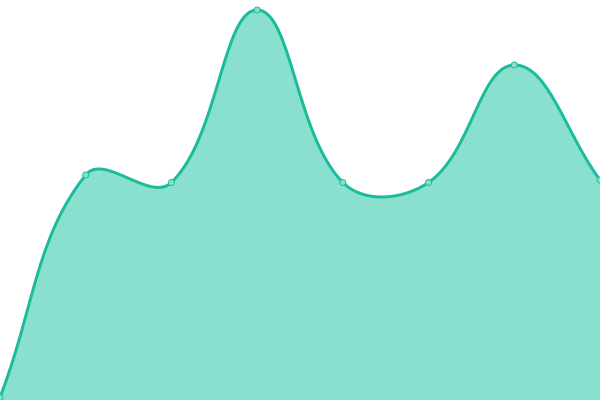
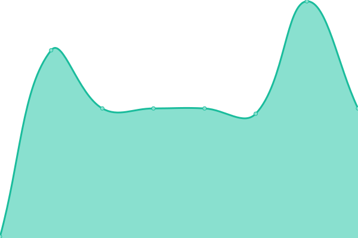

# [📈 Live Status](https://vitalibicov-hiveon.github.io/status): <!--live status--> **🟧 Partial outage**

This repository contains the open-source uptime monitor and status page for [vitalibicov-hiveon](https://vitalibicov-hiveon.github.io/status), powered by [Upptime](https://github.com/upptime/upptime).

With [Upptime](https://upptime.js.org), you can get your own unlimited and free uptime monitor and status page, powered entirely by a GitHub repository. We use [Issues](https://github.com/vitalibicov-hiveon/status/issues) as incident reports, [Actions](https://github.com/vitalibicov-hiveon/status/actions) as uptime monitors, and [Pages](https://vitalibicov-hiveon.github.io/status) for the status page.

<!--start: status pages-->
<!-- This summary is generated by Upptime (https://github.com/upptime/upptime) -->
<!-- Do not edit this manually, your changes will be overwritten -->
<!-- prettier-ignore -->
| URL | Status | History | Response Time | Uptime |
| --- | ------ | ------- | ------------- | ------ |
|  [Hiveos Farm](https://the.hiveos.farm) | 🟩 Up | [hiveos-farm.yml](https://github.com/hiveon/status/commits/HEAD/history/hiveos-farm.yml) | 

 1129ms
     
 | 

<a href="https://hiveon.github.io/status/history/hiveos-farm">100.00%</a>
    

|  [Hiveos Farm API](https://api2.hiveos.farm/api/v2/healthcheck) | 🟩 Up | [hiveos-farm-api.yml](https://github.com/hiveon/status/commits/HEAD/history/hiveos-farm-api.yml) | 

 397ms
     
 | 

<a href="https://hiveon.github.io/status/history/hiveos-farm-api">100.00%</a>
    

|  [hiveon.net site](https://hiveon.net) | 🟩 Up | [hiveon-net-site.yml](https://github.com/hiveon/status/commits/HEAD/history/hiveon-net-site.yml) | 

 360ms
     
 | 

<a href="https://hiveon.github.io/status/history/hiveon-net-site">100.00%</a>
    

|  [Pool Health](https://hiveon.net/api/v1/pool/health) | 🟥 Down | [pool-health.yml](https://github.com/hiveon/status/commits/HEAD/history/pool-health.yml) | 

 184ms
     
 | 

<a href="https://hiveon.github.io/status/history/pool-health">0.00%</a>
    

|  [btc.hiveon.com:8888](btc.hiveon.com) | 🟩 Up | [btc-hiveon-com-8888.yml](https://github.com/hiveon/status/commits/HEAD/history/btc-hiveon-com-8888.yml) | 

 116ms
     
 | 

<a href="https://hiveon.github.io/status/history/btc-hiveon-com-8888">100.00%</a>
    

|  [btc.hiveon.com:4444](btc.hiveon.com) | 🟩 Up | [btc-hiveon-com-4444.yml](https://github.com/hiveon/status/commits/HEAD/history/btc-hiveon-com-4444.yml) | 

 116ms
     
 | 

<a href="https://hiveon.github.io/status/history/btc-hiveon-com-4444">100.00%</a>
    

|  [btc.hiveon.com:20443](btc.hiveon.com) | 🟥 Down | [btc-hiveon-com-20443.yml](https://github.com/hiveon/status/commits/HEAD/history/btc-hiveon-com-20443.yml) | 

 0ms
     
 | 

<a href="https://hiveon.github.io/status/history/btc-hiveon-com-20443">0.00%</a>
    

|  [rvn.hiveon.com:8888](rvn.hiveon.com) | 🟩 Up | [rvn-hiveon-com-8888.yml](https://github.com/hiveon/status/commits/HEAD/history/rvn-hiveon-com-8888.yml) | 

 136ms
     
 | 

<a href="https://hiveon.github.io/status/history/rvn-hiveon-com-8888">100.00%</a>
    

|  [rvn.hiveon.com:9999](rvn.hiveon.com) | 🟩 Up | [rvn-hiveon-com-9999.yml](https://github.com/hiveon/status/commits/HEAD/history/rvn-hiveon-com-9999.yml) | 

 136ms
     
 | 

<a href="https://hiveon.github.io/status/history/rvn-hiveon-com-9999">100.00%</a>
    

|  [rvn.hiveon.com:7777](rvn.hiveon.com) | 🟩 Up | [rvn-hiveon-com-7777.yml](https://github.com/hiveon/status/commits/HEAD/history/rvn-hiveon-com-7777.yml) | 

 137ms
     
 | 

<a href="https://hiveon.github.io/status/history/rvn-hiveon-com-7777">100.00%</a>
    

|  [etc.hiveon.com:8888](etc.hiveon.com) | 🟩 Up | [etc-hiveon-com-8888.yml](https://github.com/hiveon/status/commits/HEAD/history/etc-hiveon-com-8888.yml) | 

 129ms
     
 | 

<a href="https://hiveon.github.io/status/history/etc-hiveon-com-8888">100.00%</a>
    

|  [etc.hiveon.com:4444](etc.hiveon.com) | 🟩 Up | [etc-hiveon-com-4444.yml](https://github.com/hiveon/status/commits/HEAD/history/etc-hiveon-com-4444.yml) | 

 129ms
     
 | 

<a href="https://hiveon.github.io/status/history/etc-hiveon-com-4444">100.00%</a>
    

|  [etc.hiveon.com:20443](etc.hiveon.com) | 🟩 Up | [etc-hiveon-com-20443.yml](https://github.com/hiveon/status/commits/HEAD/history/etc-hiveon-com-20443.yml) | 

 129ms
     
 | 

<a href="https://hiveon.github.io/status/history/etc-hiveon-com-20443">100.00%</a>
    

<!--end: status pages-->

[**Visit our status website →**](https://vitalibicov-hiveon.github.io/status)

## 📄 License

- Powered by: [Upptime](https://github.com/upptime/upptime)
- Code: [MIT](./LICENSE) © [Anand Chowdhary](https://anandchowdhary.com), supported by [Pabio](https://pabio.com)
- Data in the `./history` directory: [Open Database License](https://opendatacommons.org/licenses/odbl/1-0/)
