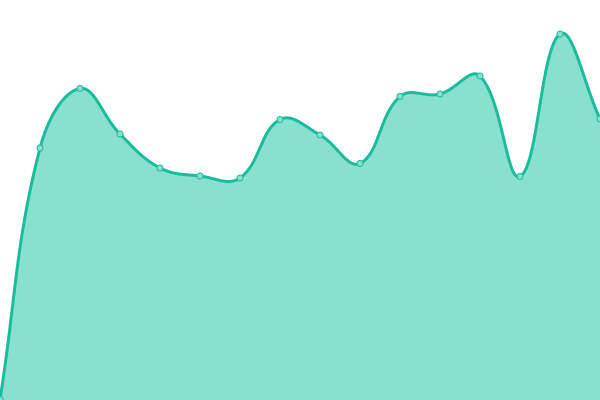
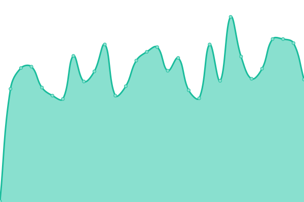
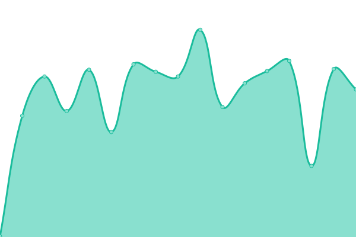
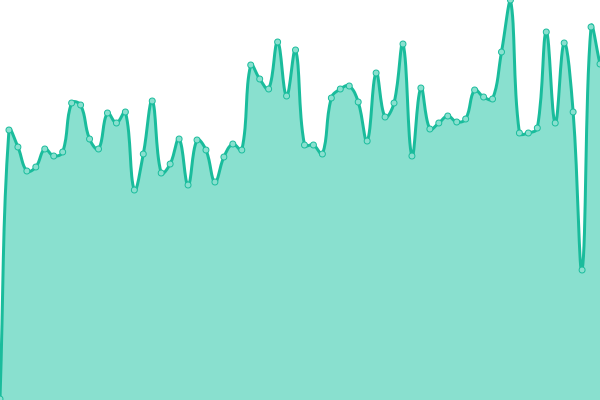

# [📈 Live Status](https://vitalibicov-hiveon.github.io/status): <!--live status--> **🟧 Partial outage**

This repository contains the open-source uptime monitor and status page for [vitalibicov-hiveon](https://vitalibicov-hiveon.github.io/status), powered by [Upptime](https://github.com/upptime/upptime).

With [Upptime](https://upptime.js.org), you can get your own unlimited and free uptime monitor and status page, powered entirely by a GitHub repository. We use [Issues](https://github.com/vitalibicov-hiveon/status/issues) as incident reports, [Actions](https://github.com/vitalibicov-hiveon/status/actions) as uptime monitors, and [Pages](https://vitalibicov-hiveon.github.io/status) for the status page.

<!--start: status pages-->
<!-- This summary is generated by Upptime (https://github.com/upptime/upptime) -->
<!-- Do not edit this manually, your changes will be overwritten -->
<!-- prettier-ignore -->
| URL | Status | History | Response Time | Uptime |
| --- | ------ | ------- | ------------- | ------ |
|  [hiveon.net Website](https://hiveon.net) | 🟩 Up | [hiveon-net-website.yml](https://github.com/hiveon/status/commits/HEAD/history/hiveon-net-website.yml) | 

 378ms
     
 | 

<a href="https://status.hiveon.net/history/hiveon-net-website">100.00%</a>
    

|  [FCR](https://status-proxy.o11y.hiveon.net/status/fcr) | 🟩 Up | [fcr.yml](https://github.com/hiveon/status/commits/HEAD/history/fcr.yml) | 

 528ms
     
 | 

<a href="https://status.hiveon.net/history/fcr">99.01%</a>
    

|  [Automation](https://status-proxy.o11y.hiveon.net/status/automation) | 🟥 Down | [automation.yml](https://github.com/hiveon/status/commits/HEAD/history/automation.yml) | 

 195ms
     
 | 

<a href="https://status.hiveon.net/history/automation">44.31%</a>
    

|  [Pool](https://status-proxy.o11y.hiveon.net/status/pool) | 🟩 Up | [pool.yml](https://github.com/hiveon/status/commits/HEAD/history/pool.yml) | 

 196ms
     
 | 

<a href="https://status.hiveon.net/history/pool">20.58%</a>
    

|  [Warehouse](https://status-proxy.o11y.hiveon.net/status/warehouse) | 🟩 Up | [warehouse.yml](https://github.com/hiveon/status/commits/HEAD/history/warehouse.yml) | 

 180ms
     
 | 

<a href="https://status.hiveon.net/history/warehouse">100.00%</a>
    

|  [Hiveon OS](https://status-proxy.o11y.hiveon.net/status/hiveon_os) | 🟥 Down | [hiveon-os.yml](https://github.com/hiveon/status/commits/HEAD/history/hiveon-os.yml) | 

 276ms
     
 | 

<a href="https://status.hiveon.net/history/hiveon-os">87.96%</a>
    

|  [Machine OS](https://status-proxy.o11y.hiveon.net/status/machine_os) | 🟩 Up | [machine-os.yml](https://github.com/hiveon/status/commits/HEAD/history/machine-os.yml) | 

 180ms
     
 | 

<a href="https://status.hiveon.net/history/machine-os">98.71%</a>
    

|  [IDP](https://status-proxy.o11y.hiveon.net/status/idp) | 🟩 Up | [idp.yml](https://github.com/hiveon/status/commits/HEAD/history/idp.yml) | 

 179ms
     
 | 

<a href="https://status.hiveon.net/history/idp">99.29%</a>
    

|  [Analytics](https://status-proxy.o11y.hiveon.net/status/analytics) | 🟩 Up | [analytics.yml](https://github.com/hiveon/status/commits/HEAD/history/analytics.yml) | 

 180ms
     
 | 

<a href="https://status.hiveon.net/history/analytics">100.00%</a>
    

|  [Reports](https://status-proxy.o11y.hiveon.net/status/reports) | 🟥 Down | [reports.yml](https://github.com/hiveon/status/commits/HEAD/history/reports.yml) | 

 178ms
     
 | 

<a href="https://status.hiveon.net/history/reports">0.00%</a>
    

|  [Energy Price Control](https://status-proxy.o11y.hiveon.net/status/energy_price_control) | 🟩 Up | [energy-price-control.yml](https://github.com/hiveon/status/commits/HEAD/history/energy-price-control.yml) | 

 181ms
     
 | 

<a href="https://status.hiveon.net/history/energy-price-control">100.00%</a>
    

<!--end: status pages-->

[**Visit our status website →**](https://vitalibicov-hiveon.github.io/status)

## 📄 License

- Powered by: [Upptime](https://github.com/upptime/upptime)
- Code: [MIT](./LICENSE) © [Anand Chowdhary](https://anandchowdhary.com), supported by [Pabio](https://pabio.com)
- Data in the `./history` directory: [Open Database License](https://opendatacommons.org/licenses/odbl/1-0/)
